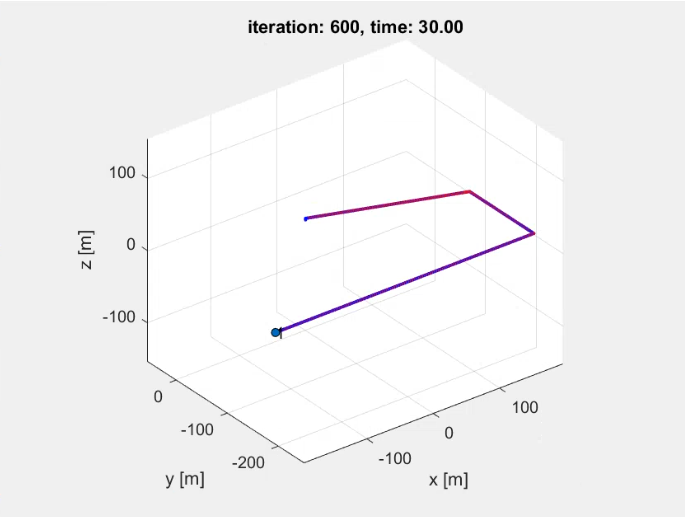

# aerial-paths-gc

The drone collects 300 points in the challenge map  
(Please check `Aeromodelling GC PS.pdf` for scoring criteria)

Below is the final trajectory travelled by the drone-

 
      

 

## Authors

* **Siddharth Saha** - [trunc8](https://github.com/trunc8)

Created with :heart: by <a href="https://www.linkedin.com/in/sahasiddharth611/">Siddharth</a>
